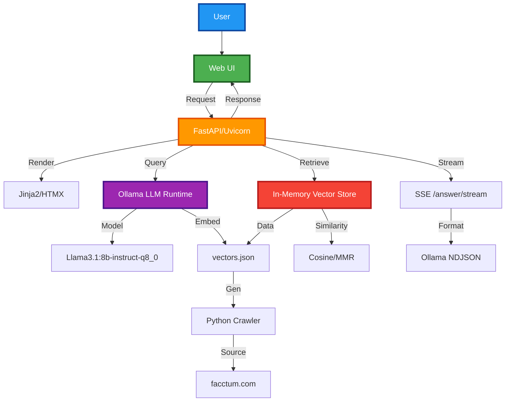

# System Architecture Flowchart

```mermaid
flowchart TD
    A[User] --> B[Web UI]
    B -->|Request| C[FastAPI/Uvicorn]
    C -->|Response| B
    
    C -->|Render| D[Jinja2/HTMX]
    C -->|Query| E[Ollama LLM Runtime]
    C -->|Retrieve| F[In-Memory Vector Store]
    C -->|Stream| G[SSE /answer/stream]
    
    E -->|Model| H[Llama3.1:8b-instruct-q8_0]
    E -->|Embed| I[vectors.json]
    F -->|Data| I
    F -->|Similarity| J[Cosine/MMR]
    G -->|Format| K[Ollama NDJSON]
    
    I -->|Gen| L[Python Crawler]
    L -->|Source| M[facctum.com]
    
    style A fill:#2196f3,stroke:#0d47a1,stroke-width:3px,color:#ffffff
    style B fill:#4caf50,stroke:#1b5e20,stroke-width:3px,color:#ffffff
    style C fill:#ff9800,stroke:#e65100,stroke-width:3px,color:#ffffff
    style E fill:#9c27b0,stroke:#4a148c,stroke-width:3px,color:#ffffff
    style F fill:#f44336,stroke:#b71c1c,stroke-width:3px,color:#ffffff
```