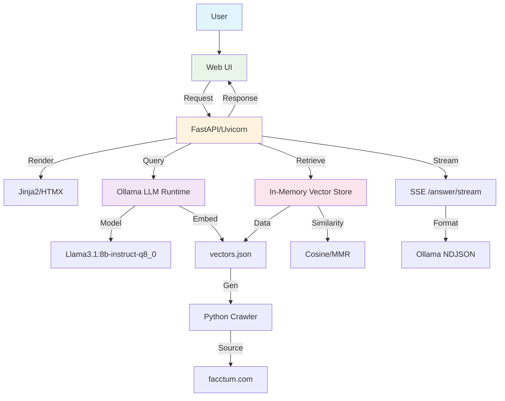

# System Architecture Flowchart

```mermaid
flowchart TD
    A[User] --> B[Web UI]
    B -->|Request| C[FastAPI/Uvicorn]
    C -->|Response| B
    
    C -->|Render| D[Jinja2/HTMX]
    C -->|Query| E[Ollama LLM Runtime]
    C -->|Retrieve| F[In-Memory Vector Store]
    C -->|Stream| G[SSE /answer/stream]
    
    E -->|Model| H[Llama3.1:8b-instruct-q8_0]
    E -->|Embed| I[vectors.json]
    F -->|Data| I
    F -->|Similarity| J[Cosine/MMR]
    G -->|Format| K[Ollama NDJSON]
    
    I -->|Gen| L[Python Crawler]
    L -->|Source| M[facctum.com]
    
    style A fill:#e1f5fe
    style B fill:#e8f5e8
    style C fill:#fff3e0
    style E fill:#f3e5f5
    style F fill:#fce4ec
```