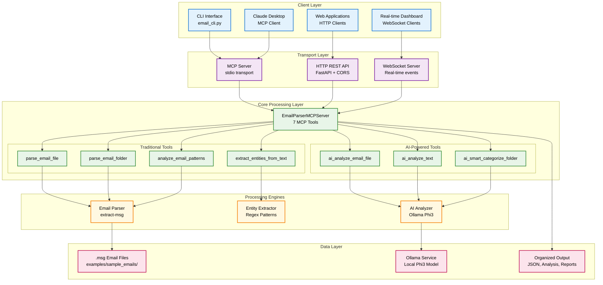
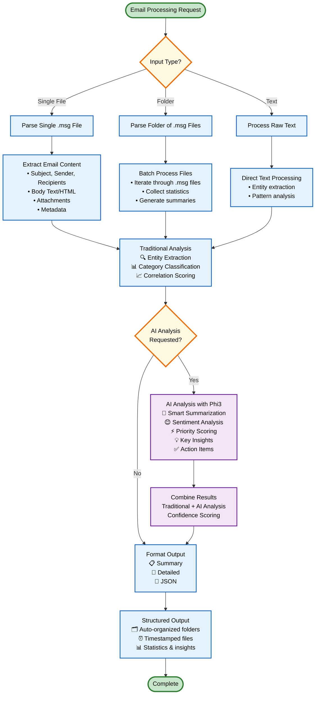

# Em-AI-lyze 🤖📧

**AI-powered email analysis with privacy-first local processing**

A modern Python application for parsing .msg email files and extracting structured insights using AI. Features both cloud (Gemini) and local (Ollama) processing with MCP (Model Context Protocol) integration for Claude Desktop.

## 🏗️ System Architecture

> **Note**: If diagrams don't render in your editor, they will display correctly on GitHub. You can also view them at [mermaid.live](https://mermaid.live/) by copying the diagram code.



### **Simplified Architecture View**
```
┌─────────────────────────────────────────────────────────────────┐
│                        CLIENT LAYER                             │
│  ┌──────────┐  ┌─────────────┐  ┌─────────┐  ┌──────────────┐   │
│  │   CLI    │  │   Claude    │  │ Web App │  │  Dashboard   │   │
│  │Interface │  │  Desktop    │  │ Client  │  │   Client     │   │
│  └──────────┘  └─────────────┘  └─────────┘  └──────────────┘   │
└─────────────────────────────────────────────────────────────────┘
                                 │
┌─────────────────────────────────────────────────────────────────┐
│                      TRANSPORT LAYER                            │
│  ┌──────────┐  ┌─────────────┐  ┌─────────────────────────────┐ │
│  │   MCP    │  │ HTTP REST   │  │       WebSocket             │ │
│  │  Server  │  │    API      │  │        Server               │ │
│  └──────────┘  └─────────────┘  └─────────────────────────────┘ │
└─────────────────────────────────────────────────────────────────┘
                                 │
┌─────────────────────────────────────────────────────────────────┐
│                    CORE PROCESSING LAYER                        │
│  ┌─────────────────────────────────────────────────────────────┐ │
│  │                    7 MCP TOOLS                             │ │
│  │  Traditional: parse_file, parse_folder, analyze_patterns   │ │
│  │  AI-Powered: ai_analyze_file, ai_analyze_text, ai_categorize│ │
│  └─────────────────────────────────────────────────────────────┘ │
└─────────────────────────────────────────────────────────────────┘
                                 │
┌─────────────────────────────────────────────────────────────────┐
│                    PROCESSING ENGINES                           │
│  ┌──────────────┐  ┌─────────────────┐  ┌──────────────────┐    │
│  │    Email     │  │   AI Analyzer   │  │     Entity       │    │
│  │    Parser    │  │  (Ollama Phi3)  │  │   Extractor      │    │
│  │ (extract-msg)│  │                 │  │ (Regex Patterns) │    │
│  └──────────────┘  └─────────────────┘  └──────────────────┘    │
└─────────────────────────────────────────────────────────────────┘
                                 │
┌─────────────────────────────────────────────────────────────────┐
│                        DATA LAYER                               │
│  ┌──────────────┐  ┌─────────────────┐  ┌──────────────────┐    │
│  │  .msg Files  │  │ Organized Output│  │ Ollama Service   │    │
│  │   (Input)    │  │    (JSON)       │  │   (Phi3 Model)   │    │
│  └──────────────┘  └─────────────────┘  └──────────────────┘    │
└─────────────────────────────────────────────────────────────────┘
```

## 🔄 Email Processing Flow

> **Note**: Interactive diagram available at [mermaid.live](https://mermaid.live/) - copy the code below to visualize.



### **Simplified Processing Flow**
```
    📥 Email Input
         │
    ┌────▼────┐
    │ Extract │ ── Subject, Sender, Body, Attachments
    │Content  │
    └────┬────┘
         │
   ┌─────▼─────┐
   │Traditional│ ── 📧 Entity Extraction
   │ Analysis  │ ── 🏷️ Category Classification  
   └─────┬─────┘ ── 📊 Correlation Scoring
         │
    ┌────▼────┐
    │AI Check?│ ──── No ──┐
    └─────────┘           │
         │ Yes            │
    ┌────▼────┐           │
    │   AI    │ ── 🤖 Smart Summary      │
    │Analysis │ ── 😊 Sentiment Analysis │
    │ (Phi3)  │ ── ⚡ Priority Scoring   │
    └────┬────┘ ── 💡 Key Insights       │
         │                              │
    ┌────▼────┐                         │
    │ Combine │ ◄──────────────────────┘
    │ Results │
    └────┬────┘
         │
    ┌────▼────┐
    │ Format  │ ── 📋 Summary / 📄 Detailed / 📱 JSON
    │ Output  │
    └────┬────┘
         │
    📁 Organized Output
    ├── 📧 emails/     (Individual parsing results)  
    ├── 📊 analysis/   (AI insights & patterns)
    ├── 🏷️ entities/   (Extracted entities)
    └── 📋 reports/    (Comprehensive analysis)
```

## ✨ Features

### 🎯 **Core Capabilities**
- **Email Parsing**: Parse .msg files and extract structured content
- **Content Standardization**: Convert subjective email content to standardized format
- **Entity Extraction**: Identify emails, phone numbers, dates, URLs, and monetary amounts
- **Correlation Analysis**: Analyze relationships between subject, body, and attachments
- **Category Classification**: Automatically categorize emails by content type
- **Pattern Analysis**: Analyze patterns across multiple emails

### 🤖 **AI-Powered Features**
- **Smart Summarization**: AI-generated concise email summaries
- **Intelligent Categorization**: Semantic understanding beyond keyword matching
- **Sentiment Analysis**: Emotional tone detection (positive, negative, neutral, concerned)
- **Priority Scoring**: AI-driven urgency assessment (0.0-1.0 scale)
- **Action Item Extraction**: Natural language understanding of tasks and requests
- **Key Insight Detection**: Business intelligence from email content

### 🌐 **Multiple Access Methods**
- **CLI Interface**: Complete command-line tool with all features
- **MCP Server**: Model Context Protocol for Claude Desktop integration
- **HTTP REST API**: RESTful endpoints for web applications
- **WebSocket Server**: Real-time processing for live dashboards

## 🚀 Quick Start

### **Prerequisites**
- Python 3.12+
- uv package manager
- Ollama with local models (for AI features)
- LangExtract for AI-powered entity extraction

### **Setup**
1. **Clone and setup:**
```bash
./setup.sh
source .venv/bin/activate
```

2. **Install Ollama and models (for AI features):**
```bash
# Install Ollama
curl -fsSL https://ollama.ai/install.sh | sh

# Pull recommended models
ollama pull llama3.2:1b     # Fast & lightweight
ollama pull phi3:mini       # Balanced performance
ollama pull mistral:latest  # Best accuracy
```

3. **Test the system:**
```bash
# Basic functionality test
python cli.py test

# Parse email with local AI
python cli.py parse --file "./examples/sample_emails/sample.msg" --local

# Extract entities from text
python cli.py extract --text "Meeting tomorrow at 2 PM" --local
```

## 📖 Usage Guide

### **🖥️ CLI Interface**

#### **Traditional Email Processing**
```bash
# Parse single email file
python cli.py parse --file email.msg --output json

# Batch process folder
python cli.py parse-folder --folder ./emails --output detailed

# Extract entities from text
python cli.py extract --text "Contact john@example.com at 555-123-4567"

# Compare processing methods
python cli.py compare --file email.msg
```

#### **🤖 AI-Powered Analysis**
```bash
# AI analyze single email with local models
python cli.py parse --file email.msg --local --model "phi3:mini"

# AI analyze arbitrary text with Ollama
python cli.py extract --text "Urgent: Budget approval needed by Friday" --local

# Smart batch categorization with different models
python cli.py parse-folder --folder ./emails --local --model "mistral:latest" --output detailed
```

#### **🌐 Server Modes**
```bash
# MCP server for Claude Desktop (local AI)
python -m src.email_parser.main --mcp --local

# MCP server with cloud AI
python -m src.email_parser.main --mcp

# HTTP REST API server
python -m src.email_parser.transports --transport http --port 8000

# WebSocket server for real-time apps
python -m src.email_parser.transports --transport websocket --port 8001
```

### **🔌 MCP Integration with Claude Desktop**

Add to your Claude Desktop configuration:
```json
{
  "mcpServers": {
    "em-ai-lyze": {
      "command": "python",
      "args": ["-m", "src.email_parser.main", "--mcp", "--local"],
      "cwd": "/path/to/em-ai-lyze"
    }
  }
}
```

**Available MCP Tools:**
- `parse_email_file` - Parse single .msg file with AI analysis
- `parse_email_folder` - Batch process folders with AI insights
- `analyze_email_patterns` - Pattern analysis across emails
- `extract_entities_from_text` - AI-powered entity extraction

### **🌐 HTTP API Endpoints**

Start HTTP server: `python email_cli.py server --http --port 8000`

```bash
# Parse single file
curl -X POST http://localhost:8000/api/parse/file \
  -H "Content-Type: application/json" \
  -d '{"file_path": "./email.msg", "format": "detailed"}'

# AI analysis
curl -X POST http://localhost:8000/api/ai/analyze-file \
  -H "Content-Type: application/json" \
  -d '{"file_path": "./email.msg"}'

# Pattern analysis
curl -X POST http://localhost:8000/api/analyze/patterns \
  -H "Content-Type: application/json" \
  -d '{"folder_path": "./emails", "analysis_type": "categories"}'
```

## 📊 Output Organization

The system automatically organizes outputs in structured folders:

```
output/
├── emails/          # Individual email parsing results
├── analysis/        # Pattern analysis and AI insights
├── entities/        # Entity extraction results
└── reports/         # Comprehensive analysis reports
```

**File naming:** `category_description_YYYYMMDD_HHMMSS.json`

## 🛠️ Development

### **Setup Development Environment**
```bash
# Install with development dependencies
uv pip install -e ".[dev,ai,network]"

# Install pre-commit hooks
pre-commit install
```

### **Code Quality**
```bash
# Run tests
python -m pytest tests/

# Format code
black src/ && isort src/

# Type checking
mypy src/

# Linting
flake8 src/ --max-line-length=88
```

### **Available Make Commands**
```bash
make help     # Show all available commands
make test     # Run test suite
make format   # Format code
make lint     # Run linting
make clean    # Clean generated files
```

## 📋 Requirements

### **System Requirements**
- **Python**: 3.12+ 
- **Package Manager**: uv (recommended) or pip
- **Memory**: 4GB+ (8GB+ recommended for AI features)
- **Storage**: 2GB+ (for Phi3 model)

### **Dependencies**
- **Core**: `extract-msg`, `fastmcp`, `python-dateutil`
- **Network**: `fastapi`, `uvicorn`, `websockets` (optional)
- **AI**: `langextract`, `ollama`, `requests` (optional)
- **Dev**: `pytest`, `black`, `mypy`, `flake8` (optional)

## 🎯 Use Cases

### **🏢 Enterprise Email Analysis**
- **Compliance Monitoring**: Analyze emails for regulatory compliance
- **Business Intelligence**: Extract insights from email communications
- **Workflow Automation**: Identify action items and priority tasks

### **🤖 AI Assistant Integration**  
- **Claude Desktop**: Direct integration with MCP tools
- **Custom AI Workflows**: Build intelligent email processing pipelines
- **Semantic Search**: AI-powered email categorization and insights

### **🔍 Email Forensics & Discovery**
- **Legal Discovery**: Extract structured data from email archives
- **Security Analysis**: Identify suspicious patterns and entities
- **Communication Patterns**: Analyze sender/recipient relationships

### **📊 Data Analytics**
- **Sentiment Tracking**: Monitor communication tone over time
- **Priority Analysis**: Identify high-impact communications
- **Entity Mapping**: Extract and correlate business entities

## 🤝 Contributing

We welcome contributions! Please see our contributing guidelines:

1. **Fork** the repository
2. **Create** a feature branch (`git checkout -b feature/amazing-feature`)
3. **Commit** your changes (`git commit -m 'Add amazing feature'`)
4. **Push** to the branch (`git push origin feature/amazing-feature`)
5. **Open** a Pull Request

### **Development Guidelines**
- Follow PEP 8 style guidelines
- Add tests for new features
- Update documentation as needed
- Ensure all tests pass before submitting

## 📜 License

This project is licensed under the MIT License - see the [LICENSE](LICENSE) file for details.

## 🙏 Acknowledgments

- **[extract-msg](https://github.com/TeamMsgExtractor/msg-extractor)** - Core .msg file parsing
- **[Ollama](https://ollama.com/)** - Local AI model hosting
- **[FastMCP](https://github.com/jlowin/fastmcp)** - Model Context Protocol implementation
- **[LangExtract](https://github.com/google/langextract)** - AI-powered structured information extraction
- **[Llama 3.2](https://ollama.com/library/llama3.2)** - Meta's efficient language models
- **[Phi-3](https://ollama.com/library/phi3)** - Microsoft's balanced language model
- **[Mistral](https://ollama.com/library/mistral)** - High-accuracy language model

## 📞 Support

For questions, issues, or feature requests:

- **GitHub Issues**: [Report bugs or request features](https://github.com/devraj21/em-ai-lyze/issues)
- **Documentation**: Check the comprehensive guides in the [docs/](docs/) folder
- **Community**: Join discussions in GitHub Discussions

---

**⭐ Star this repository if you find it helpful!**
