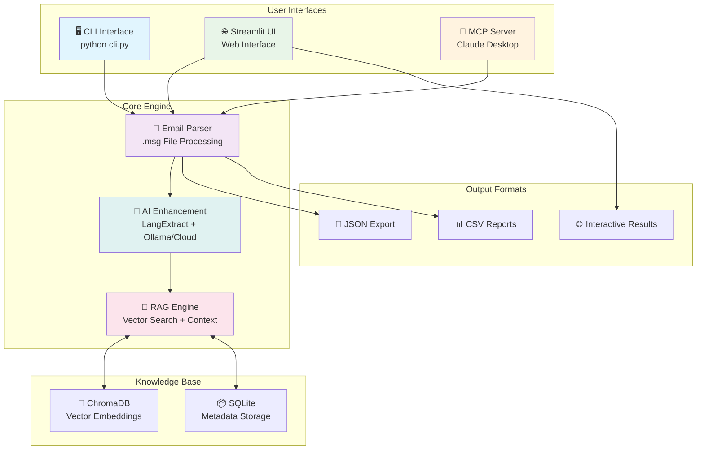

# Em-AI-lyze: AI-Powered Email Analysis

Advanced email parsing and analysis tool with AI enhancement, RAG knowledge base, and multi-interface support.



## 🚀 Quick Start

### Installation
```bash
# Clone repository
git clone https://github.com/devraj21/em-ai-lyze.git
cd em-ai-lyze

# Setup environment
./setup.sh
source .venv/bin/activate

# Install with AI capabilities
uv pip install -e ".[ai]"

# Install with RAG capabilities  
uv pip install -e ".[rag]"

# Install everything
uv pip install -e ".[all]"
```

### Basic Usage
```bash
# Test installation
python cli.py test

# Parse single email
python cli.py parse --file email.msg

# Start web interface
python start_streamlit.py

# Start MCP server for Claude Desktop
python -m src.email_parser.main --mcp --local
```

## 🔧 Features

- **🤖 AI-Powered Analysis**: Local Ollama + Cloud AI models
- **🧠 RAG Knowledge Base**: Learn from historical emails  
- **📊 Multiple Export Formats**: JSON, CSV, Excel
- **🌐 Web Interface**: Interactive Streamlit UI
- **🔌 Claude Desktop Integration**: MCP server support
- **📧 Email Processing**: Extract entities, sentiment, categories
- **🔍 Semantic Search**: Find similar emails by meaning

## 📚 Documentation

For complete documentation, see the `/docs` folder:
- [Installation Guide](docs/Installation_Guide.md)
- [CLI Usage Guide](docs/CLI_Usage_Guide.md) 
- [RAG CLI Guide](docs/RAG_CLI_Guide.md)
- [Streamlit UI Guide](docs/Streamlit_UI_Guide.md)