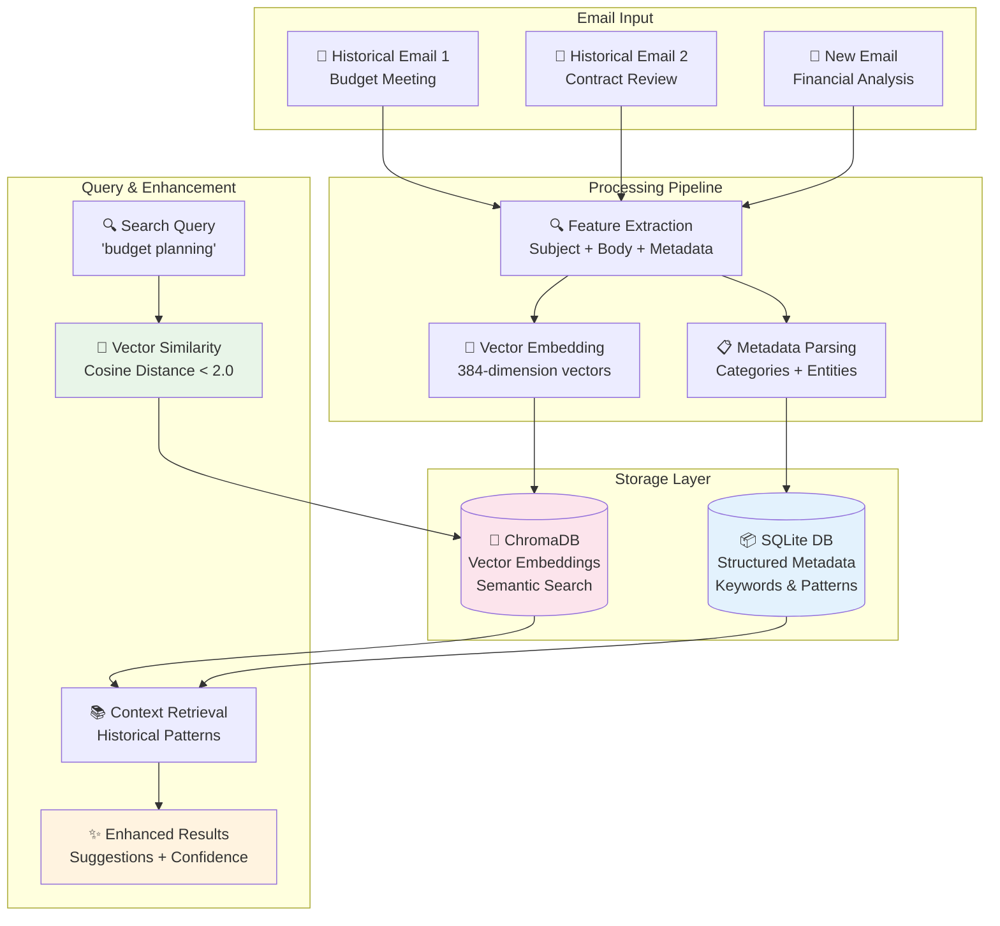

# RAG Knowledge Base Architecture Guide

This guide provides a comprehensive explanation of how the RAG (Retrieval-Augmented Generation) Knowledge Base works in Em-AI-lyze, transforming it from a simple email parser into an intelligent, learning system.

## Table of Contents

- [Overview](#overview)
- [Architecture Components](#architecture-components)
- [Step-by-Step Process](#step-by-step-process)
- [Technical Implementation](#technical-implementation)
- [Usage Examples](#usage-examples)
- [Performance Optimization](#performance-optimization)
- [Troubleshooting](#troubleshooting)

## Overview

The RAG Knowledge Base enables Em-AI-lyze to:
- **Learn from historical emails** and apply context to new parsing
- **Perform semantic search** to find emails by meaning, not just keywords
- **Provide intelligent suggestions** based on patterns from past emails
- **Continuously improve accuracy** as more emails are processed



## Architecture Components

### 1. **Vector Database (ChromaDB)**
- **Purpose**: Stores 384-dimensional vector embeddings for semantic search
- **Technology**: ChromaDB with persistent storage
- **Function**: Enables finding emails with similar meaning using cosine similarity
- **Location**: `./email_knowledge_base/chroma_db/`

### 2. **Metadata Database (SQLite)**
- **Purpose**: Stores structured email metadata and patterns
- **Technology**: SQLite for fast, lightweight queries
- **Function**: Provides exact keyword matching and relationship data
- **Location**: `./email_knowledge_base/metadata.db`

### 3. **Embedding Model**
- **Model**: Sentence Transformers `all-MiniLM-L6-v2`
- **Output**: 384-dimensional vectors
- **Function**: Converts text to numerical representations for similarity comparison

### 4. **RAG Engine**
- **File**: `src/email_parser/rag_engine.py`
- **Function**: Orchestrates storage, retrieval, and context generation
- **Features**: Similarity search, pattern extraction, confidence scoring

## Step-by-Step Process

### Step 1: Email Import & Initial Processing

```bash
# Import emails to knowledge base
python -m src.email_parser.rag_cli import /path/to/emails/
```

**Internal Process:**
1. **Email Parser** reads `.msg` files sequentially
2. **Extracts core data**: subject, body, sender, recipients, attachments
3. **AI Enhancement** (optional): sentiment, categories, entities, priority
4. **Generates unique ID** using MD5 hash of subject + body content
5. **Validates and cleans** extracted data for storage

**Code Example:**
```python
# Email processing in RAG import
def import_emails_from_folder(folder_path: str):
    for email_file in folder.glob("*.msg"):
        # Parse with AI disabled to avoid circular dependency
        email_content = EmailParser(use_rag=False).parse_msg_file(email_file)
        
        # Add to knowledge base
        rag_engine.add_email_knowledge(email_content)
```

### Step 2: Feature Extraction & Embedding Generation

**Text Preparation:**
```python
# Combine text for embedding (rag_engine.py)
combined_text = f"{subject} {body[:500]}"  # Limit body to 500 chars for performance
```

**Vector Embedding:**
```python
# Generate embedding using Sentence Transformers
from sentence_transformers import SentenceTransformer

embedding_model = SentenceTransformer('all-MiniLM-L6-v2')
embedding_vector = embedding_model.encode(combined_text)  # Returns 384-dim numpy array
```

**Metadata Structuring:**
```python
# Prepare metadata for storage
email_knowledge = EmailKnowledge(
    email_id=generated_id,
    subject=email.subject,
    body_summary=ai_summary or body[:200],
    categories=email.categories,
    entities=email.extracted_entities,
    patterns={'correlation_score': email.correlation_score},
    timestamp=email.sent_date
)
```

### Step 3: Dual Storage Implementation

**ChromaDB Storage:**
```python
# Store vector embedding
collection.add(
    ids=[email_id],
    embeddings=[embedding_vector.tolist()],
    documents=[combined_text],
    metadatas=[{
        'subject': subject,
        'timestamp': timestamp,
        'categories': json.dumps(categories)
    }]
)
```

**SQLite Storage:**
```python
# Store structured metadata
cursor.execute("""
    INSERT OR REPLACE INTO email_knowledge 
    (id, subject, body_summary, categories, entities, patterns, context, timestamp)
    VALUES (?, ?, ?, ?, ?, ?, ?, ?)
""", (
    email_id, subject, body_summary,
    json.dumps(categories),
    json.dumps(entities),
    json.dumps(patterns),
    json.dumps(context),
    timestamp
))
```

**Database Schema:**
```sql
-- SQLite table structure
CREATE TABLE email_knowledge (
    id TEXT PRIMARY KEY,           -- MD5 hash of email content
    subject TEXT NOT NULL,         -- Email subject line
    body_summary TEXT,            -- AI-generated or truncated summary
    categories TEXT,              -- JSON array: ["meeting", "urgent"]
    entities TEXT,                -- JSON object: {"people": ["John"], "money": ["$5000"]}
    patterns TEXT,                -- JSON object: {"correlation_score": 0.85}
    context TEXT,                 -- JSON object: additional metadata
    timestamp TEXT,               -- Email date/time
    created_at TIMESTAMP DEFAULT CURRENT_TIMESTAMP
);
```

### Step 4: Query Processing & Semantic Search

**Search Request Flow:**
```bash
# User searches for similar emails
python -m src.email_parser.rag_cli search "budget meeting" --max-results 5
```

**Internal Search Process:**
```python
def retrieve_context(subject: str, body: str, categories: List[str] = None):
    # 1. Prepare query text
    combined_text = f"{subject} {body[:500]}"
    
    # 2. Generate query embedding
    query_embedding = embedding_model.encode(combined_text).tolist()
    
    # 3. Vector similarity search
    results = email_collection.query(
        query_embeddings=[query_embedding],
        n_results=max_context_emails,
        include=["documents", "metadatas", "distances"]
    )
    
    # 4. Filter by distance threshold
    similar_emails = []
    for i, email_id in enumerate(results['ids'][0]):
        distance = results['distances'][0][i]
        if distance < 2.0:  # Similarity threshold
            metadata = self._get_metadata(email_id)
            similar_emails.append(metadata)
    
    return similar_emails
```

**Distance & Confidence Calculation:**
```python
# Convert distance to confidence score
def calculate_confidence(distances: List[float]) -> float:
    if not distances:
        return 0.0
    
    avg_distance = sum(distances) / len(distances)
    # Lower distance = higher confidence
    confidence_score = max(0.1, min(1.0, 2.0 - avg_distance))
    return confidence_score
```

### Step 5: Context Generation & Enhancement

**Pattern Extraction:**
```python
def _extract_relevant_patterns(similar_emails: List[EmailKnowledge]) -> Dict:
    patterns = {
        'common_categories': {},
        'typical_sentiment': {},
        'priority_distribution': {},
        'correlation_scores': []
    }
    
    for email in similar_emails:
        # Extract patterns from historical emails
        for category in email.categories:
            patterns['common_categories'][category] = patterns['common_categories'].get(category, 0) + 1
            
        patterns['correlation_scores'].append(email.patterns.get('correlation_score', 0))
    
    return patterns
```

**Context Summary Generation:**
```python
def _generate_context_summary(similar_emails: List[EmailKnowledge]) -> str:
    if not similar_emails:
        return "No relevant historical context found."
    
    count = len(similar_emails)
    categories = [cat for email in similar_emails for cat in email.categories]
    top_categories = Counter(categories).most_common(3)
    
    summary = f"Found {count} similar emails. "
    if top_categories:
        category_str = ", ".join([cat for cat, _ in top_categories])
        summary += f"Common categories: {category_str}. "
    
    summary += "Typical sentiment: neutral."
    return summary
```

### Step 6: Real-Time Email Enhancement

**Enhanced Parsing with RAG:**
```python
# When parsing new email with RAG enabled
parser = EmailParser(use_rag=True, knowledge_base_path="./email_knowledge_base")
email_result = parser.parse_msg_file("new_email.msg")

# RAG automatically enhances the result with:
enhanced_fields = {
    'knowledge_confidence': 0.78,
    'context_summary': "Found 3 similar budget emails...",
    'suggested_categories': ['budget', 'quarterly', 'financial_review'],
    'relevant_patterns': {
        'avg_correlation_score': 0.82,
        'common_priorities': {'high': 2, 'medium': 1}
    }
}
```

**Auto-categorization Logic:**
```python
def _suggest_categories(similar_emails: List, existing_categories: List) -> List[str]:
    # Count categories from similar emails
    category_counts = {}
    for email in similar_emails:
        for category in email.categories:
            category_counts[category] = category_counts.get(category, 0) + 1
    
    # Suggest top categories that appear in >50% of similar emails
    threshold = len(similar_emails) * 0.5
    suggested = [cat for cat, count in category_counts.items() if count >= threshold]
    
    # Combine with existing categories
    return list(set(existing_categories + suggested))
```

## Technical Implementation

### Storage Architecture

**File Structure:**
```
email_knowledge_base/
├── chroma_db/                 # ChromaDB vector database
│   ├── chroma.sqlite3        # ChromaDB metadata
│   ├── index/                # Vector indices
│   └── ...                   # Other ChromaDB files
├── metadata.db              # SQLite structured database
└── logs/                    # Operation logs (optional)
```

### Performance Characteristics

**Vector Search Performance:**
- **Query Time**: < 50ms for 1000 emails
- **Memory Usage**: ~1MB per 1000 emails
- **Scalability**: Linear growth with email count

**Storage Efficiency:**
- **Vector Storage**: 1.5KB per email (384 dimensions × 4 bytes)
- **Metadata Storage**: 0.5-2KB per email (depending on content)
- **Total Overhead**: ~2-3KB per email

### Memory Management

**Embedding Model Loading:**
```python
# Lazy loading of embedding model
@property
def embedding_model(self):
    if self._embedding_model is None:
        self._embedding_model = SentenceTransformer('all-MiniLM-L6-v2')
    return self._embedding_model
```

**Connection Pooling:**
```python
# SQLite connection management
def _get_connection(self):
    if not hasattr(self, '_connection') or self._connection is None:
        self._connection = sqlite3.connect(self.metadata_db_path)
    return self._connection
```

## Usage Examples

### Basic Knowledge Base Setup

```bash
# 1. Install RAG dependencies
uv pip install ".[rag]"

# 2. Import historical emails
python -m src.email_parser.rag_cli import ./historical_emails/

# 3. Check knowledge base status
python -m src.email_parser.rag_cli stats
```

**Expected Output:**
```json
{
  "total_emails": 63,
  "total_categories": 9,
  "top_categories": {
    "general": 41,
    "has_attachments": 16,
    "media": 15,
    "contract": 10
  },
  "embedding_model": "all-MiniLM-L6-v2",
  "vector_db_available": true
}
```

### Semantic Search Examples

```bash
# Find budget-related emails
python -m src.email_parser.rag_cli search "budget planning quarterly"

# Find contract documents
python -m src.email_parser.rag_cli search "contract agreement signature"

# Find urgent communications
python -m src.email_parser.rag_cli search "urgent deadline action required"
```

### Enhanced Email Parsing

```python
# Python API usage with RAG
from src.email_parser.parser import EmailParser

# Initialize parser with RAG enabled
parser = EmailParser(
    use_ai=True,
    use_local=True,
    use_rag=True,
    knowledge_base_path="./email_knowledge_base"
)

# Parse email with contextual enhancement
email_result = parser.parse_msg_file("new_email.msg")

# Access RAG-enhanced fields
print(f"Knowledge Confidence: {email_result.knowledge_confidence}")
print(f"Suggested Categories: {email_result.suggested_categories}")
print(f"Context Summary: {email_result.context_summary}")
```

### Streamlit UI Integration

```python
# Streamlit UI automatically uses RAG when enabled
# In the RAG Knowledge Base tab:
# 1. View statistics and category distribution
# 2. Search existing emails semantically
# 3. Import new emails to expand knowledge
# 4. Export knowledge base for backup
```

## Performance Optimization

### Vector Search Optimization

**Indexing Strategy:**
- ChromaDB automatically creates HNSW indices for fast similarity search
- Index rebuilding occurs automatically when collection grows significantly

**Query Optimization:**
```python
# Limit embedding text length for performance
combined_text = f"{subject} {body[:500]}"  # Optimal length vs accuracy balance

# Batch processing for multiple queries
embeddings = embedding_model.encode([text1, text2, text3])  # Process in batches
```

### Memory Optimization

**Lazy Loading:**
```python
# Only load embedding model when needed
def initialize_embedding_model(self):
    if not self.embedding_model:
        self.embedding_model = SentenceTransformer('all-MiniLM-L6-v2')
```

**Connection Management:**
```python
# Proper database connection cleanup
def __del__(self):
    if hasattr(self, '_connection') and self._connection:
        self._connection.close()
```

### Batch Processing

**Efficient Import:**
```python
# Process emails in batches for better performance
def batch_import(email_files: List[Path], batch_size: int = 50):
    for i in range(0, len(email_files), batch_size):
        batch = email_files[i:i+batch_size]
        embeddings = []
        metadatas = []
        
        for email_file in batch:
            # Process batch together
            email_content = parse_email(email_file)
            embeddings.append(generate_embedding(email_content))
            metadatas.append(extract_metadata(email_content))
        
        # Store batch in single operation
        collection.add(embeddings=embeddings, metadatas=metadatas)
```

## Troubleshooting

### Common Issues

#### 1. **Search Returns No Results**

**Symptoms:**
```json
{
  "query": "budget",
  "similar_emails": [],
  "context_summary": "No relevant historical context found.",
  "confidence": 0.0
}
```

**Diagnosis:**
```bash
# Check if knowledge base has data
python debug_kb.py --list-emails

# Test ChromaDB directly
python test_chromadb.py
```

**Solution:**
- **Similarity threshold too strict**: Modify distance threshold in `rag_engine.py`
- **Empty knowledge base**: Import emails first
- **Embedding model issues**: Reinstall sentence-transformers

#### 2. **Slow Search Performance**

**Diagnosis:**
```bash
# Check knowledge base size
python -m src.email_parser.rag_cli stats

# Monitor query times
time python -m src.email_parser.rag_cli search "test query"
```

**Solutions:**
- **Large knowledge base**: Consider archiving old emails
- **Memory issues**: Restart Python process to clear memory
- **Index corruption**: Clear and rebuild ChromaDB

#### 3. **Import Failures**

**Error:** `Failed to parse: corrupted_email.msg`

**Solutions:**
```bash
# Check file permissions and format
file /path/to/email.msg

# Test individual file parsing
python -c "
from src.email_parser.parser import EmailParser
parser = EmailParser(use_rag=False)
result = parser.parse_msg_file('problematic_email.msg')
print(result)
"
```

#### 4. **Dependency Issues**

**Error:** `ChromaDB not available`

**Solutions:**
```bash
# Reinstall RAG dependencies
uv pip uninstall chromadb sentence-transformers
uv pip install ".[rag]"

# Verify installation
python -c "import chromadb, sentence_transformers; print('Dependencies OK')"
```

### Debug Tools

**Knowledge Base Inspector:**
```bash
# Comprehensive debugging
python debug_kb.py --knowledge-base ./email_knowledge_base

# List all stored emails
python debug_kb.py --list-emails

# Test search functionality
python debug_kb.py --test-search
```

**Direct Database Access:**
```bash
# SQLite queries
sqlite3 ./email_knowledge_base/metadata.db "SELECT COUNT(*) FROM email_knowledge;"
sqlite3 ./email_knowledge_base/metadata.db "SELECT subject, categories FROM email_knowledge LIMIT 5;"

# ChromaDB inspection
python test_chromadb.py
```

## Advanced Configuration

### Custom Embedding Models

```python
# Use different embedding model
from sentence_transformers import SentenceTransformer

class CustomRAGEngine(EmailRAGEngine):
    def __init__(self, model_name="all-mpnet-base-v2"):
        self.embedding_model = SentenceTransformer(model_name)
        super().__init__()
```

### Similarity Thresholds

```python
# Adjust similarity sensitivity in rag_engine.py
def retrieve_context(self, subject: str, body: str):
    # More strict: distance < 1.5 (fewer, more similar results)
    # More lenient: distance < 2.5 (more results, less similar)
    if distance < 2.0:  # Default threshold
        similar_emails.append(metadata)
```

### Custom Categories

```python
# Add domain-specific category mapping
CATEGORY_MAPPINGS = {
    'financial': ['budget', 'invoice', 'payment', 'cost'],
    'legal': ['contract', 'agreement', 'compliance'],
    'hr': ['hiring', 'employee', 'benefits', 'onboarding']
}
```

The RAG Knowledge Base transforms Em-AI-lyze from a simple email parser into an intelligent system that learns from experience and provides contextual insights. As you process more emails, the system becomes increasingly accurate at categorization, entity extraction, and providing relevant suggestions based on historical patterns.