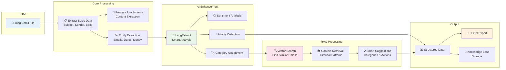
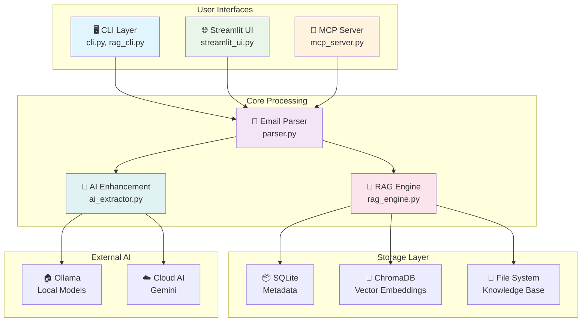
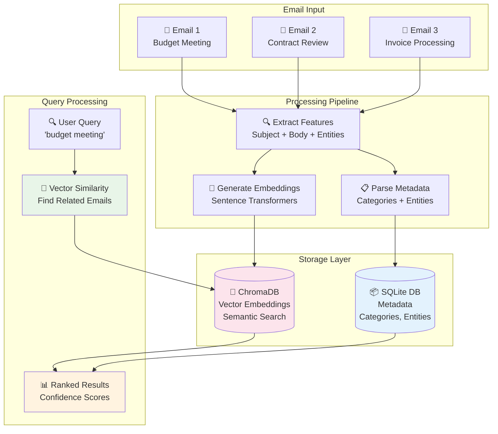

# Em-AI-lyze Documentation

Welcome to the Em-AI-lyze documentation. This AI-powered email analysis tool provides comprehensive parsing, analysis, and knowledge management for .msg email files.

## 📚 Documentation Index

### Getting Started
- [Installation Guide](Installation_Guide.md) - Setup and installation instructions
- [Quick Start Guide](Quick_Start.md) - Get up and running in minutes
- [CLI Usage Guide](CLI_Usage_Guide.md) - Command-line interface reference

### Core Features
- [Email Parsing Guide](Email_Parsing_Guide.md) - Understanding email parsing capabilities
- [AI Integration Guide](AI_Integration_Guide.md) - AI-powered analysis features
- [RAG CLI Guide](RAG_CLI_Guide.md) - Knowledge base management with RAG

### Advanced Topics
- [MCP Server Guide](MCP_Server_Guide.md) - Model Context Protocol server setup
- [API Reference](API_Reference.md) - Python API documentation
- [Configuration Guide](Configuration_Guide.md) - Advanced configuration options

### Deployment
- [Production Deployment](Production_Deployment.md) - Production setup guide
- [Docker Guide](Docker_Guide.md) - Containerized deployment
- [Performance Tuning](Performance_Tuning.md) - Optimization tips

## 🚀 Quick Navigation

### I want to...

**Parse emails quickly**
→ [CLI Usage Guide](CLI_Usage_Guide.md#basic-commands)

**Set up AI analysis** 
→ [AI Integration Guide](AI_Integration_Guide.md#setup)

**Build a knowledge base**
→ [RAG CLI Guide](RAG_CLI_Guide.md#quick-start)

**Integrate with Claude Desktop**
→ [MCP Server Guide](MCP_Server_Guide.md#claude-desktop-setup)

**Use the Python API**
→ [API Reference](API_Reference.md#python-api)

**Deploy in production**
→ [Production Deployment](Production_Deployment.md)

## 🔧 Core Components

### 1. Email Parser (`src/email_parser/parser.py`)
- Core email parsing functionality
- .msg file processing
- Entity extraction
- Correlation analysis

### 2. AI Integration (`src/email_parser/ai_extractor.py`)
- LangExtract integration
- Local and cloud AI models
- Enhanced entity recognition
- Sentiment analysis

### 3. RAG Engine (`src/email_parser/rag_engine.py`)
- Vector database storage
- Semantic search
- Knowledge base management
- Contextual retrieval

### 4. MCP Server (`src/email_parser/mcp_server.py`)
- Model Context Protocol implementation
- Claude Desktop integration
- Tool and prompt definitions
- Resource management

### 5. CLI Tools
- `cli.py` - Main CLI interface
- `src/email_parser/rag_cli.py` - RAG management CLI
- `src/email_parser/main.py` - MCP server entry point

## 🔄 Email Processing Flow



## 📖 Feature Matrix

| Feature | Basic | AI Enhanced | RAG Enhanced |
|---------|-------|-------------|--------------|
| Email Parsing | ✅ | ✅ | ✅ |
| Entity Extraction | Regex | AI + Regex | AI + Context |
| Categorization | Keywords | AI Categories | Historical Context |
| Correlation Analysis | Word Overlap | Semantic | Context-Aware |
| Knowledge Learning | ❌ | ❌ | ✅ |
| Contextual Suggestions | ❌ | ❌ | ✅ |

## 🔗 Quick Links

### Configuration Files
- `pyproject.toml` - Project configuration and dependencies
- `CLAUDE.md` - Claude Code integration instructions
- `.env` - Environment variables (create from examples)

### Installation Options
```bash
# Basic installation
uv pip install -e .

# With AI capabilities
uv pip install -e ".[ai]"

# With RAG capabilities  
uv pip install -e ".[rag]"

# Everything included
uv pip install -e ".[all]"
```

### Quick Commands
```bash
# Test system
python cli.py test

# Parse email
python cli.py parse --file email.msg

# Start MCP server
python -m src.email_parser.main --mcp --local

# Manage knowledge base
python -m src.email_parser.rag_cli stats
```

## 🏗️ Architecture Overview



## 🌟 Key Benefits

### 1. **Multi-Modal Analysis**
- Subject line analysis
- Email body processing  
- Attachment content extraction
- Cross-component correlation

### 2. **AI-Powered Intelligence**
- Local AI with Ollama (privacy-focused)
- Cloud AI with Gemini (high accuracy)
- Fallback to regex patterns

### 3. **Contextual Learning**
- RAG-based knowledge accumulation
- Historical pattern recognition
- Continuous improvement

### 4. **Flexible Integration**
- Claude Desktop MCP server
- Python API
- REST API endpoints
- WebSocket support

### 5. **Production Ready**
- Robust error handling
- Comprehensive logging
- Performance optimization
- Security best practices

## 🧠 RAG Knowledge Base Architecture



## 📊 Use Cases

### Enterprise Email Analysis
- Automated email classification
- Compliance checking
- Sentiment analysis
- Priority detection

### Knowledge Management
- Email archival and search
- Pattern recognition
- Organizational learning
- Context preservation

### Development Integration
- Email processing pipelines
- AI-powered workflows
- Claude Desktop tools
- Custom applications

## 🔮 Roadmap

### Near Term
- [ ] Enhanced attachment processing (PDF, DOCX content)
- [ ] Multi-language support
- [ ] Advanced search operators
- [ ] Performance dashboards

### Medium Term  
- [ ] Web interface
- [ ] Database backend options
- [ ] Workflow automation
- [ ] Advanced analytics

### Long Term
- [ ] Email generation capabilities
- [ ] Integration marketplace
- [ ] Enterprise features
- [ ] Cloud deployment options

## 📞 Support

### Documentation Issues
If you find issues with the documentation:
1. Check the specific guide for your use case
2. Review the troubleshooting sections
3. Consult the API reference for technical details

### Getting Help
- Review the relevant documentation sections
- Check the troubleshooting guides
- Examine log files for error details
- Test with minimal examples

### Contributing
- Documentation improvements welcome
- Code contributions follow standard practices
- Issue reports should include relevant details

---

**Version**: 1.0.0  
**Last Updated**: 2024-08-17  
**Compatibility**: Python 3.12+